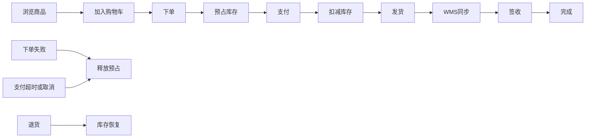
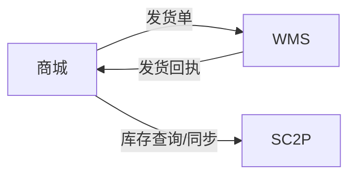

# 电商系统 MFQ 测试方案

## M - 模型层

### 1. 端到端业务流程模型

### 2. 订单状态机

| 当前状态 | 触发事件 | 条件 | 下一状态 | 库存动作 |
|---------|---------|------|---------|---------|
| 待支付 | 用户下单 | 库存充足 | 待支付 | 预占 |
| 待支付 | 支付成功 | | 已支付 | 扣减（异步） |
| 待支付 | 超时/取消 | | 已取消 | 释放预占 |
| 已支付 | 发货 | WMS 回执 | 已发货 | - |
| 已发货 | 用户签收 | | 已完成 | - |
| 已完成 | 申请退货 | 审核通过 | 退货中 | 恢复库存 |

### 3. 库存状态模型

- **可用库存**：实际可售数量
- **预占库存**：下单未支付，临时锁定
- **已售库存**：支付成功，实际扣减
- **恢复**：取消订单 → 释放预占；退货 → 增加可用

### 4. 外部交互模型

### 5. 一致性边界

- **强一致**：预占库存与下单事务（本地事务）
- **最终一致**：支付后扣减、发货状态回传（异步重试+对账）
- **对账节点**：每日 T+1 对账商城与 WMS 库存差异

## F - 功能层 (Functional)

### 核心主流程（高优先级）

| 场景 | 测试点 | 预期结果 |
|------|--------|----------|
| 下单-支付-发货-签收 | 完整正向流程 | 库存从可用→预占→扣减→发货后不可回滚 |
| 库存不足下单 | 下单时可用库存=0 | 返回失败，不创建订单，不预占 |
| 支付超时取消 | 15分钟未支付 | 订单自动取消，预占库存释放 |
| 用户主动取消 | 待支付状态取消 | 立即释放预占 |
| 拆单发货 | 订单含多商品，部分缺货 | 有货部分发货，缺货部分等待或取消 |

### 库存同步专项测试（强制）

#### 预占成功/失败

- 下单同时发送库存预占请求 → 成功则订单创建，失败则订单取消
- 并发预占同一商品最后1件 → 仅一笔成功

#### 扣减成功/失败

- 支付成功后触发扣减，WMS 返回成功 → 状态变更
- WMS 扣减失败（网络超时、库存版本冲突）→ 重试3次，最终进入人工介入队列

#### 取消订单恢复库存

- 待支付取消 → 释放预占（同步）
- 已支付未发货取消 → 调用 WMS 释放已售库存（异步，需支持幂等）

#### 重复消息幂等性

- 支付回调重发3次 → 仅扣减一次，拒绝重复
- WMS 发货回执重复 → 订单状态不重复变更

#### 乱序消息处理

- 先收到发货回执，后收到支付回调 → 拒绝发货回执，等待支付完成后再处理
- 使用消息序号或业务时间戳判断

### 边界场景

| 场景 | 输入条件 | 期望行为 |
|------|----------|----------|
| 零库存 | 库存=0时下单 | 提示缺货，不预占 |
| 秒杀高并发 | 1000请求抢10件库存 | 仅10人成功，数据库锁或乐观锁控制 |
| 部分发货 | 订单2件，只发1件 | 订单状态为“部分发货”，剩余商品可继续发货或取消 |
| 退货恢复库存 | 用户退货成功 | 可用库存+=退货数量，同时记录退货流水 |

### 关键 API 校验

| API | 必填字段 | 错误码示例 | 回调回写校验 |
|-----|---------|-----------|-------------|
| /createOrder | userId, skuId, quantity | 1001(库存不足) | 返回订单号 |
| /payCallback | orderId, amount, transId | 2001(签名错误) | 订单状态变更为已支付 |
| /wms/ship | orderId, logisticsNo | 3001(订单不存在) | 商城侧更新物流单号 |

## Q - 质量层 (Quality)

### 性能

| 维度 | 目标值 |
|------|--------|
| 下单接口 TPS | ≥ 500 (普通场景)，≥ 2000 (秒杀) |
| 支付回调延迟 | P99 < 200ms |
| 库存扣减错误率 | < 0.01% |
| 消息积压阈值 | > 1000 触发告警 |

### 可靠性

- **重试**：支付回调失败 → 指数退避重试3次；WMS接口超时 → 重试+死信队列
- **降级**：库存服务不可用 → 下单时降级为“库存预检”+人工补单
- **超时**：订单15分钟未支付自动取消（定时扫描）
- **熔断**：WMS连续失败5次 → 熔断30秒，走异步补偿
- **补偿任务**：每小时扫描“预占超15分钟未支付”订单 → 强制释放；扫描“已支付超1小时未发货” → 告警

### 可观测性

- **日志**：每个库存变更记录 traceId、订单号、变更前/后数量
- **指标**：库存差异率（商城 vs WMS）、消息积压数量、卡单数量（状态机停留超时）
- **告警**：  
  - 库存差异率 > 0.5%  
  - 消息积压 > 5000  
  - 订单在“待支付”超15分钟未处理

### 安全性

- **鉴权**：所有 API 需携带 JWT token，调用 WMS 使用双向 SSL
- **权限边界**：运营后台仅可查询、不可修改库存；退款需二次审批
- **敏感数据**：用户地址脱敏展示（仅显示省市区+最后4位门牌）

### 可恢复性
- **故障演练**：每月 Chaos 实验 —— 模拟 Redis 宕机、WMS 慢查询、网络分区，验证降级与补偿链路
- **数据修复**：提供管理工具，支持单订单库存修复（需审批与审计日志）

## 发布准入 / 准出标准 (Entry/Exit Criteria)

### 准入标准 (Entry)

- [ ] 核心主流程（下单→签收）自动化测试通过率 100%
- [ ] 库存同步专项测试（预占、扣减、取消恢复）全部通过
- [ ] 性能基准测试完成，且无大于 P99 延迟超标的接口
- [ ] 代码覆盖率 ≥ 80%（关键模块：库存服务、订单状态机）
- [ ] 所有已知 P0/P1 缺陷已关闭
- [ ] 发布计划与回滚方案已评审

### 准出标准 (Exit)

- [ ] 全量回归测试执行完成，通过率 ≥ 99.5%
- [ ] 高可用演练（单节点宕机、消息队列故障）不导致数据不一致
- [ ] 可观测性仪表盘（库存差异、消息积压）上线并可验证
- [ ] 对外部系统（WMS/SC2P）的 mock 与真实环境对比测试通过
- [ ] 发布窗口已预留 2 小时灰度观察时间
- [ ] 运维手册（含补偿脚本与回滚操作）已更新

## 附录：方案落地补充（公司具体环境未知仅供参考）

### 1. 数据准备与环境要求

| 场景 | 数据准备 | 环境要求 |
|------|---------|----------|
| **功能测试** | 至少准备：3个SPU、每个SPU下2个SKU、库存数量分别为0、1、100 | 独立测试环境，与生产隔离；WMS/SC2P使用**Mock服务**（可用Postman Mock Server或WireMock） |
| **秒杀压测** | 单商品库存100件，同时在线用户数模拟2000，思考时间0~1秒 | 性能测试环境与功能环境分离；JMeter分布式施压（1个主控+3个施压机） |
| **库存对账测试** | 准备100笔历史订单，其中10笔人为制造差异（商城与WMS不一致） | 需要有独立的对账数据库，支持每日T+1任务触发 |
| **WMS模拟** | Mock接口需支持：正常响应、超时（5秒）、返回错误码（500）、重复推送 | 使用**Postman Mock Server** 或 **pytest+flask** 自建轻量Mock |

### 2. 缺陷分级标准（P0/P1/P2）

| 等级 | 定义 | 电商示例 | 处理要求 |
|------|------|----------|----------|
| **P0** | 核心业务流程完全阻塞，或导致直接资损/超卖，无合理规避方案 | • 下单后无法支付 • 支付成功但库存未扣减 • 超卖（已售 > 可用+预占） • 订单状态机卡死无法流转 | 阻塞发布，必须立即修复 |
| **P1** | 重要功能异常，有规避方案，或影响体验但不直接造成资损 | • 取消订单后库存恢复延迟（最终一致但超过30分钟） • 部分发货失败但未告警 • 管理后台查询订单超时 | 可在本次发布中修复，但必须提供补偿方案 |
| **P2** | 边缘场景或UI/提示问题，不影响核心交易链路 | • 错误提示不友好 • 日志打印缺失traceId • 非关键字段校验遗漏 | 可随下一版本修复，不阻塞发布 |

### 3. 测试工具与框架

| 测试类型 | 工具/框架 | 用途说明 |
|----------|-----------|----------|
| **接口自动化** | Postman + Newman（CI集成） + pytest（可选） | Postman用于单接口调试与集合测试；pytest用于复杂场景（如状态机流转、数据库断言） |
| **性能测试** | JMeter | 线程组模拟并发，使用“事务控制器”统计下单/支付接口吞吐量，配合“聚合报告”查看TPS与错误率 |
| **故障注入（Chaos）** | 手动 + JMeter + 脚本 | 因环境限制，采用轻量方案： - 使用JMeter模拟超时/错误响应 - 使用`kill -9`杀死应用进程测试熔断 - 使用网络限速工具（如`tc`）模拟延迟 |
| **库存对账** | Python脚本（pytest + pandas） | 每日拉取商城订单表与WMS流水表，对比差异输出CSV报告 |
| **Mock服务** | Postman Mock Server 或 `pytest + Flask` | 模拟WMS/SC2P的各种响应（正常、超时、错误、乱序） |

### 4. 回滚机制细节（发布失败后的数据恢复）

#### 触发回滚的条件
- 发布后10分钟内，**库存差异率 > 0.5%** 或 **支付回调错误率 > 1%**
- 出现P0级线上缺陷（如超卖、支付后未扣库存）
- 核心接口P99延迟上升超过发布前2倍

#### 回滚步骤

| 步骤 | 动作 | 负责人 | 数据一致性保障 |
|------|------|--------|----------------|
| 1 | 停止灰度/全量流量，切流至旧版本 | 运维/SRE | 使用网关切流，正在处理的请求允许完成 |
| 2 | **订单与库存数据检查** | 测试/开发 | 运行对账脚本，输出差异订单清单 |
| 3 | **数据修复**（按优先级） | 开发 / DBA | • **P0差异**：人工执行修复SQL（需审批） • **P1差异**：触发补偿任务自动修复 • **无差异**：直接回滚代码 |
| 4 | 回滚应用版本（镜像或二进制） | 运维 | 保持数据库结构不变（避免回滚DDL） |
| 5 | 验证核心流程（冒烟测试） | 测试 | 执行Postman核心集合，确保下单-支付-发货可通 |
| 6 | 恢复流量，观察监控 | 全员 | 观察库存差异率与错误率降至正常水平 |

#### 数据回滚专项（避免“回滚后数据更乱”）
- **预占库存**：回滚后若订单在新版本创建但未支付，旧版本可能不识别的订单需**手动取消并释放预占**
- **已支付订单**：不删除，仅状态回退（如“已发货”回退为“已支付”），需调用WMS拦截发货
- **对账红线**：任何回滚必须附带**对账报告**，证明商城与WMS数据一致后再切流
